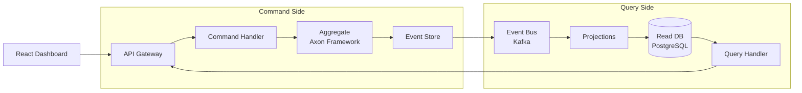
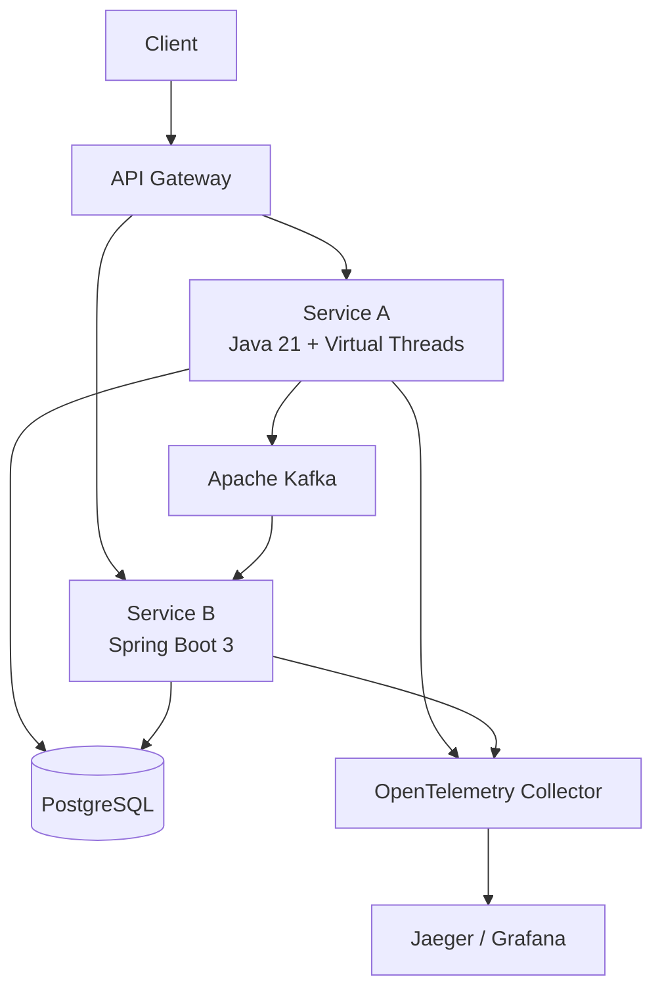
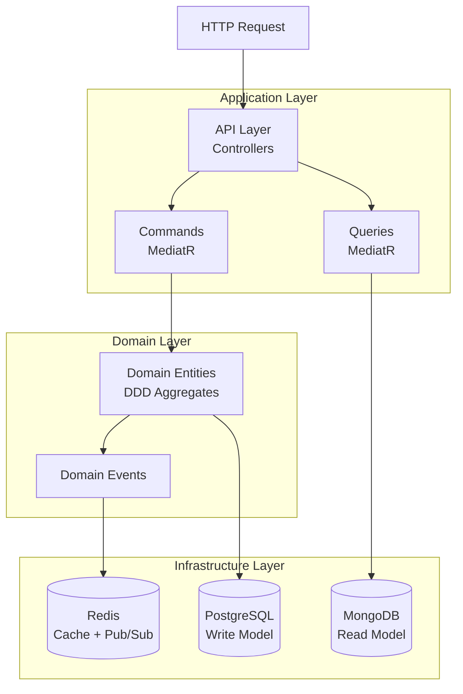
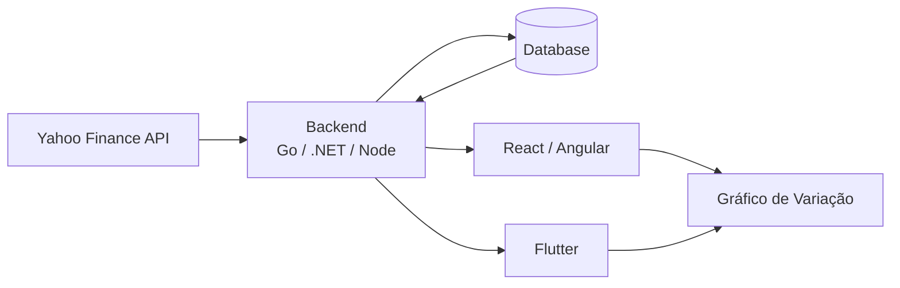
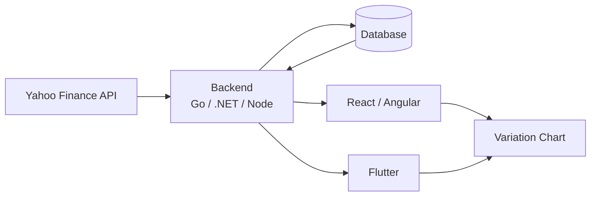
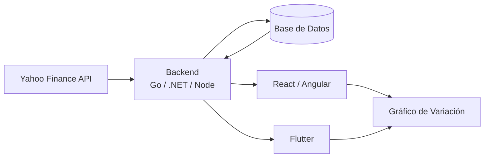

<div align="center">

**🌐 Language / Idioma:**
&nbsp;[🇧🇷 Português](#-português)&nbsp;·&nbsp;[🇺🇸 English](#-english)&nbsp;·&nbsp;[🇪🇸 Español](#-español)

</div>

---

## 🇧🇷 Português

<div align="center">

# 👋 Olá, eu sou Lucas Albuquerque

🚀 **Engenheiro Full Stack (16 anos)**<br>
💳 Construindo sistemas financeiros de alta escala<br>
⚡ Focado em performance, escalabilidade & sistemas distribuídos

</div>

---

### 🧠 Sobre Mim

```diff
+ Processando milhões de transações diariamente
+ Forte foco em arquiteturas distribuídas
+ Mentalidade de engenharia orientada a performance
```

Comecei a programar com **Java** na empresa da minha família em Campo Grande/MS e evoluí para construir **sistemas de alta performance e missão crítica** para um dos maiores bancos da América Latina.

Hoje, projeto **arquiteturas escaláveis e orientadas a eventos** que operam sob carga extrema e restrições rígidas de confiabilidade.

---

### 🛠️ Stack

**Backend**


**Frontend**


**Cloud & DevOps**


**Mensageria**


**Dados**


**IA**


---

### 📊 GitHub Stats

<div align="center">

[](https://github.com/ryo-ma/github-profile-trophy)


</div>

---

### 🐍 Contribuições

<div align="center">

<picture>
  <source media="(prefers-color-scheme: dark)" srcset="https://raw.githubusercontent.com/LucasGeek/LucasGeek/output/github-contribution-grid-snake-dark.svg" />
  <source media="(prefers-color-scheme: light)" srcset="https://raw.githubusercontent.com/LucasGeek/LucasGeek/output/github-contribution-grid-snake.svg" />
  
</picture>

</div>

---

### 🏗️ Projetos em Destaque

| Projeto | Descrição |
|---|---|
| [**developer-evaluation**](https://github.com/LucasGeek/developer-evaluation) | Sales API · .NET 8 · Clean Architecture · CQRS + DDD · PostgreSQL + MongoDB + Redis |
| [**java-microservices-reference**](https://github.com/LucasGeek/java-microservices-reference) | Java 21 + Virtual Threads · Spring Boot 3 · Kafka · PostgreSQL · OpenTelemetry |
| [**event-driven-cqrs-demo**](https://github.com/LucasGeek/event-driven-cqrs-demo) | CQRS + Event Sourcing · Axon Framework · Kafka · React dashboard |
| [**k8s-platform-toolkit**](https://github.com/LucasGeek/k8s-platform-toolkit) | Terraform · Helm Charts · GitOps com ArgoCD |
| [**fullstack-fintech-app**](https://github.com/LucasGeek/fullstack-fintech-app) | Spring Boot + React · PostgreSQL · Autenticação OAuth2 |
| [**langchain4j-rag-example**](https://github.com/LucasGeek/langchain4j-rag-example) | RAG em Java · Embeddings · Banco vetorial para busca semântica |
| [**go-high-perf-api**](https://github.com/LucasGeek/go-high-perf-api) | API de alta performance em Go · Benchmark vs Java Virtual Threads |
| [**notification-app-java-php**](https://github.com/LucasGeek/notification-app-java-php) | API de notificações em Java (Clean Arch + DDD) e PHP (Laravel) · Docker |
| [**variacao-ativo-fullstack**](https://github.com/LucasGeek/variacao-ativo-fullstack) | Rastreador de variação de ativos · Yahoo Finance API · Flutter + Go + React |

---

### 🧱 Diagramas de Arquitetura

<details>
<summary><strong>event-driven-cqrs-demo</strong> — CQRS + Event Sourcing</summary>



</details>

<details>
<summary><strong>java-microservices-reference</strong> — Microserviços com Observabilidade</summary>



</details>

<details>
<summary><strong>developer-evaluation</strong> — Clean Architecture · CQRS · DDD</summary>



</details>

<details>
<summary><strong>variacao-ativo-fullstack</strong> — Fullstack com Yahoo Finance</summary>



</details>

---

### 🏆 Certificações


---

### 🌐 Conecte-se

[](https://linkedin.com/in/lucasgeek)

---

### ⚡ Mentalidade de Engenharia

```txt
Performance é uma funcionalidade.
Escalabilidade é um requisito.
Confiabilidade é inegociável.
```

<div align="right">

⭐ *Se você gosta do meu trabalho, considere dar uma estrela nos repositórios!*

[🔝 Voltar ao topo](#-português)

</div>

---
---

## 🇺🇸 English

<div align="center">

# 👋 Hey, I'm Lucas Albuquerque

🚀 **Full Stack Engineer (16)**<br>
💳 Building high-scale financial systems<br>
⚡ Focused on performance, scalability & distributed systems

</div>

---

### 🧠 About Me

```diff
+ Processing millions of transactions daily
+ Strong focus on distributed architectures
+ Performance-driven engineering mindset
```

I started programming with **Java** in a family business in Campo Grande/MS and evolved into building **high-performance, mission-critical systems** for one of the largest banks in Latin America.

Today, I design **scalable, event-driven architectures** that operate under extreme load and strict reliability constraints.

---

### 🛠️ Tech Stack

**Backend**


**Frontend**


**Cloud & DevOps**


**Streaming**


**Data**


**AI**


---

### 📊 GitHub Stats

<div align="center">

[](https://github.com/ryo-ma/github-profile-trophy)


</div>

---

### 🐍 Contribution Graph

<div align="center">

<picture>
  <source media="(prefers-color-scheme: dark)" srcset="https://raw.githubusercontent.com/LucasGeek/LucasGeek/output/github-contribution-grid-snake-dark.svg" />
  <source media="(prefers-color-scheme: light)" srcset="https://raw.githubusercontent.com/LucasGeek/LucasGeek/output/github-contribution-grid-snake.svg" />
  
</picture>

</div>

---

### 🏗️ Highlight Projects

| Project | Description |
|---|---|
| [**developer-evaluation**](https://github.com/LucasGeek/developer-evaluation) | Sales API · .NET 8 · Clean Architecture · CQRS + DDD · PostgreSQL + MongoDB + Redis |
| [**java-microservices-reference**](https://github.com/LucasGeek/java-microservices-reference) | Java 21 + Virtual Threads · Spring Boot 3 · Kafka · PostgreSQL · OpenTelemetry |
| [**event-driven-cqrs-demo**](https://github.com/LucasGeek/event-driven-cqrs-demo) | CQRS + Event Sourcing · Axon Framework · Kafka · React dashboard |
| [**k8s-platform-toolkit**](https://github.com/LucasGeek/k8s-platform-toolkit) | Terraform · Helm Charts · GitOps with ArgoCD |
| [**fullstack-fintech-app**](https://github.com/LucasGeek/fullstack-fintech-app) | Spring Boot + React · PostgreSQL · OAuth2 authentication |
| [**langchain4j-rag-example**](https://github.com/LucasGeek/langchain4j-rag-example) | RAG in Java · Embeddings · Vector database for semantic search |
| [**go-high-perf-api**](https://github.com/LucasGeek/go-high-perf-api) | High-performance API in Go · Benchmark vs Java Virtual Threads |
| [**notification-app-java-php**](https://github.com/LucasGeek/notification-app-java-php) | Notification API in Java (Clean Arch + DDD) and PHP (Laravel) · Docker |
| [**variacao-ativo-fullstack**](https://github.com/LucasGeek/variacao-ativo-fullstack) | Asset price variation tracker · Yahoo Finance API · Flutter + Go + React |

---

### 🧱 Architecture Diagrams

<details>
<summary><strong>event-driven-cqrs-demo</strong> — CQRS + Event Sourcing</summary>


</details>

<details>
<summary><strong>java-microservices-reference</strong> — Microservices with Observability</summary>


</details>

<details>
<summary><strong>developer-evaluation</strong> — Clean Architecture · CQRS · DDD</summary>


</details>

<details>
<summary><strong>variacao-ativo-fullstack</strong> — Fullstack with Yahoo Finance</summary>



</details>

---

### 🏆 Certifications


---

### 🌐 Connect

[](https://linkedin.com/in/lucasgeek)

---

### ⚡ Engineering Mindset

```txt
Performance is a feature.
Scalability is a requirement.
Reliability is non-negotiable.
```

<div align="right">

⭐ *If you like my work, consider starring the repositories!*

[🔝 Back to top](#-english)

</div>

---
---

## 🇪🇸 Español

<div align="center">

# 👋 Hola, soy Lucas Albuquerque

🚀 **Ingeniero Full Stack (16)**<br>
💳 Construyendo sistemas financieros de alta escala<br>
⚡ Enfocado en rendimiento, escalabilidad & sistemas distribuidos

</div>

---

### 🧠 Sobre Mí

```diff
+ Procesando millones de transacciones diariamente
+ Fuerte enfoque en arquitecturas distribuidas
+ Mentalidad de ingeniería orientada al rendimiento
```

Comencé a programar con **Java** en el negocio familiar en Campo Grande/MS y evolucioné hacia la construcción de **sistemas de alto rendimiento y misión crítica** para uno de los bancos más grandes de América Latina.

Hoy diseño **arquitecturas escalables y orientadas a eventos** que operan bajo carga extrema y restricciones estrictas de fiabilidad.

---

### 🛠️ Stack Tecnológico

**Backend**


**Frontend**


**Cloud & DevOps**


**Mensajería**


**Datos**


**IA**


---

### 📊 GitHub Stats

<div align="center">

[](https://github.com/ryo-ma/github-profile-trophy)


</div>

---

### 🐍 Gráfico de Contribuciones

<div align="center">

<picture>
  <source media="(prefers-color-scheme: dark)" srcset="https://raw.githubusercontent.com/LucasGeek/LucasGeek/output/github-contribution-grid-snake-dark.svg" />
  <source media="(prefers-color-scheme: light)" srcset="https://raw.githubusercontent.com/LucasGeek/LucasGeek/output/github-contribution-grid-snake.svg" />
  
</picture>

</div>

---

### 🏗️ Proyectos Destacados

| Proyecto | Descripción |
|---|---|
| [**developer-evaluation**](https://github.com/LucasGeek/developer-evaluation) | Sales API · .NET 8 · Clean Architecture · CQRS + DDD · PostgreSQL + MongoDB + Redis |
| [**java-microservices-reference**](https://github.com/LucasGeek/java-microservices-reference) | Java 21 + Virtual Threads · Spring Boot 3 · Kafka · PostgreSQL · OpenTelemetry |
| [**event-driven-cqrs-demo**](https://github.com/LucasGeek/event-driven-cqrs-demo) | CQRS + Event Sourcing · Axon Framework · Kafka · React dashboard |
| [**k8s-platform-toolkit**](https://github.com/LucasGeek/k8s-platform-toolkit) | Terraform · Helm Charts · GitOps con ArgoCD |
| [**fullstack-fintech-app**](https://github.com/LucasGeek/fullstack-fintech-app) | Spring Boot + React · PostgreSQL · Autenticación OAuth2 |
| [**langchain4j-rag-example**](https://github.com/LucasGeek/langchain4j-rag-example) | RAG en Java · Embeddings · Base de datos vectorial para búsqueda semántica |
| [**go-high-perf-api**](https://github.com/LucasGeek/go-high-perf-api) | API de alto rendimiento en Go · Benchmark vs Java Virtual Threads |
| [**notification-app-java-php**](https://github.com/LucasGeek/notification-app-java-php) | API de notificaciones en Java (Clean Arch + DDD) y PHP (Laravel) · Docker |
| [**variacao-ativo-fullstack**](https://github.com/LucasGeek/variacao-ativo-fullstack) | Rastreador de variación de activos · Yahoo Finance API · Flutter + Go + React |

---

### 🧱 Diagramas de Arquitectura

<details>
<summary><strong>event-driven-cqrs-demo</strong> — CQRS + Event Sourcing</summary>


</details>

<details>
<summary><strong>java-microservices-reference</strong> — Microservicios con Observabilidad</summary>


</details>

<details>
<summary><strong>developer-evaluation</strong> — Clean Architecture · CQRS · DDD</summary>


</details>

<details>
<summary><strong>variacao-ativo-fullstack</strong> — Fullstack con Yahoo Finance</summary>



</details>

---

### 🏆 Certificaciones


---

### 🌐 Conectar

[](https://linkedin.com/in/lucasgeek)

---

### ⚡ Mentalidad de Ingeniería

```txt
El rendimiento es una funcionalidad.
La escalabilidad es un requisito.
La fiabilidad es innegociable.
```

<div align="right">

⭐ *¡Si te gusta mi trabajo, considera darle una estrella a los repositorios!*

[🔝 Volver arriba](#-español)

</div>
